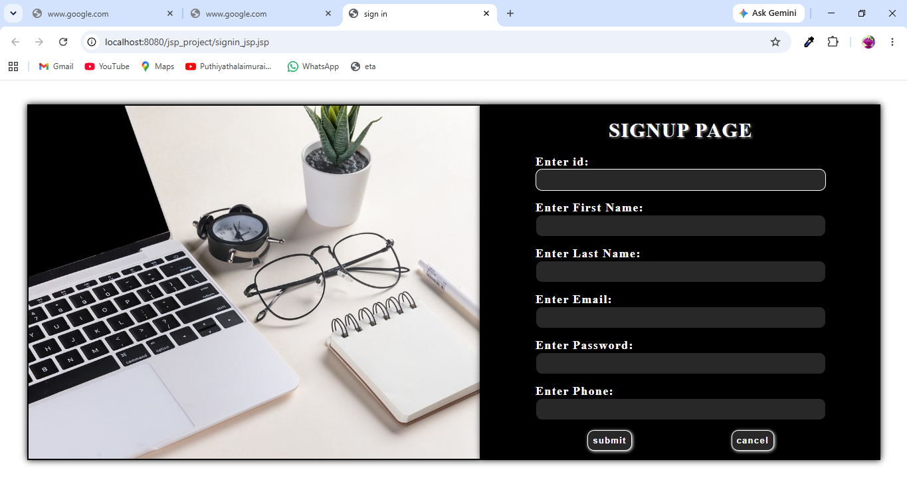
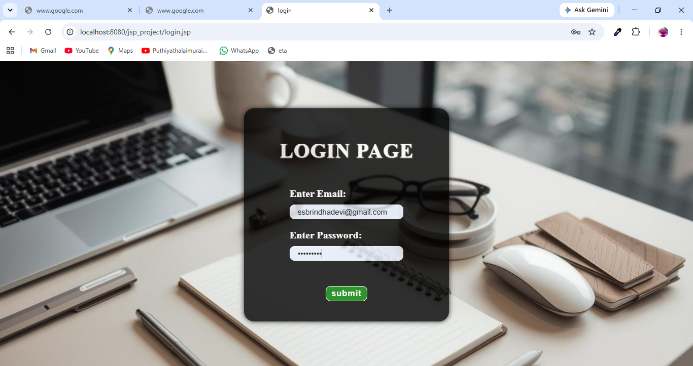
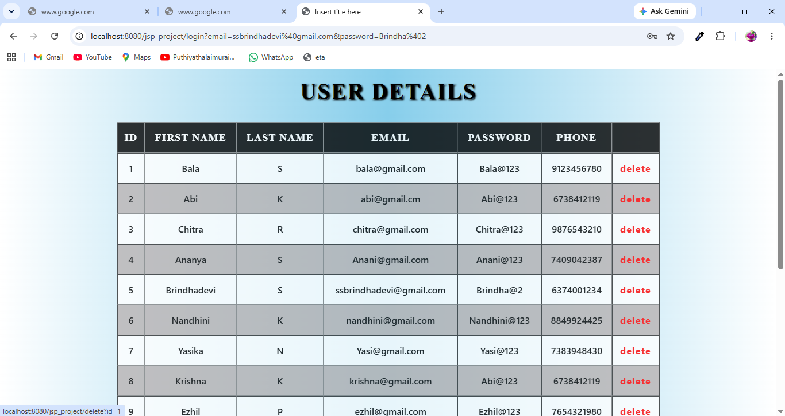

# 📌 JSP User Management System

A simple web-based **User Management System** built using **JSP, Servlets, JDBC, and MySQL**.  
It allows users to register, login, and manage user data with database integration.

---

## 🚀 Features
- User Signup  
- User Login  
- Display User Details  
- Store user data in MySQL  
- Basic form validation  

---

## 🛠️ Technologies Used
- Java  
- JSP  
- Servlets  
- JDBC  
- MySQL  
- HTML, CSS  

---

## 📂 Project Type
Java Web Application

---

## ⚙️ How to Run
1. Import project into Eclipse (Dynamic Web Project)  
2. Configure Apache Tomcat server  
3. Create MySQL database and tables  
4. Update DB credentials in JDBC file  
5. Run on server:  
http://localhost:8080/YourProjectName/

---

## 📸 Screenshots

  
  
  
---
## 👨‍💻 Note
This project is already implemented and used for learning JSP, Servlet, and database connectivity.
